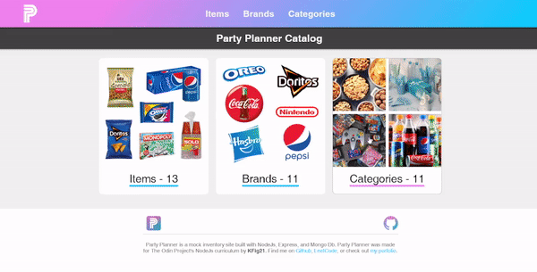

# Party Planner

<a href="https://kfig21.github.io/node_inventory_app/" target="_blank" rel="noopener noreferrer">View the project here!</a> 👀

<h3>Summary</h3>

Party Planner was made for <a href="https://www.theodinproject.com/paths/full-stack-javascript/courses/nodejs/lessons/inventory-application" target="_blank" rel="noopener noreferrer">The Odin Project's</a> NodeJS curriculum. The goal of the project is to build an inventory management app for a business. This project taught the basics for building a CRUD application and relational data using MongoDB.

 <h3>Technologies:</h3>
  <ul>
  <li>MongoDB</li>
  <li>Express</li>
  <li>NodeJS</li>
  <li>Pug</li>
  <li>Amazon S3 Bucket</li>
 </ul>

 <h3>Features:</h3>
 <ul>
  <li>Create an item/brand/category</li>
  <li>Update an item/brand/category</li>
  <li>Delete an item</li>
  <li>Amazon S3 bucket used to host images</li>
  <li>Responsive design for desktop and mobile.</li>
 </ul>
 
<h3>Demo GIF</h3>

 ---

<h3>Thanks for checking out my project! Any && all feedback is appreciated!</h3>
